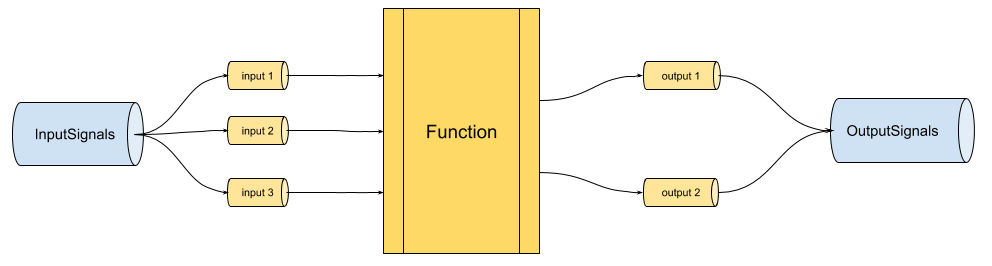

# Streaming Interaction Model Specification
When running in streaming mode, a function invoker MUST behave as a gRPC server and answer to the following rpc (defined by its [full protobuf definition](riff-rpc.proto)):
```
service Riff {
    rpc Invoke (stream InputSignal) returns (stream OutputSignal) {}
}
```

That streaming rpc will be invoked by a *streaming processor* whose responsibility is to send (streaming) input parameters to the invoker, as well as forward back the (streaming) output parameters that it receives from the invoker. Where those input parameters come from, where the output parameters end up or when the streaming processor decides to trigger an rpc (slicing the input streams into *windows*) is entirely the responsibility of the streaming processor and is beyond the scope of this document.

Because gRPC allows only one input parameter and one output parameter in an rpc definition, it is likely that a streaming processor will *multiplex* input parameters and *de-multiplex* output parameters that it receives back. Conversely, it will be the responsibility of the invoker to *de-multiplex* the input parameters and *multiplex* the return parameters back.



The streaming protocol relies heavily on the concept of *content-type*: a piece of information (hereafter *headers*) that instructs how to interpret a *payload*, made of a series of bytes. Such a content-type may be used to depict input data, or to instruct a function to produce output data in a certain fashion (see `expectedContentTypes` later in this document)

## Lifecycle
When a streaming invoker starts, it MUST start a gRPC server on the port defined by the `GRPC_PORT` environment variable (it MUST fallback to using 8081 if that variable is not defined). That server MUST be able to satisfy the `Invoke()` rpc defined above. It MAY load the function early although an invoker MAY also assume that user functions may be poorly written and may maintain (mutable) state when they shouldn't, and hence MAY decide to re-load the function at each rpc invocation.

As a general rule, the unit of interaction is the rpc invocation. What that means is that any state accumulated for a given invocation SHOULD be cleared as soon as the invocation ends, and that two invocations MUST not share state.

## Invocation
Invocations of the rpc by the streaming processor MAY happen concurrently and the invoker MUST maintain isolation of state inside the function as much as possible given the target runtime. In particular, it is expected that each invocation of the rpc will trigger one and exactly one invocation of the function. Function authors MAY decide to maintain state per-invocation or more globally per-function *instance* but it is not the responsibility of the invoker to protect against race conditions in those cases.

For each invocation of the rpc, the invoker will have access to a stream of `InputSignals` that may convey incoming data to the function and a stream of `OutputSignals` that are used to forward data produced by the function back to the streaming invoker. Those two streams of data MUST be handled as fully asynchronous and autonomous: the invoker may receive several (including zero) `InputFrames` after the `StartFrame` (see below) before it sends any `OutputFrames`.

This behavior is entirely a consequence of how the function is implemented, and an invoker MUST allow non-blocking receiving of input signals relative to the production of output signals.

## Input Signals
For each invocation of the rpc, an invoker MUST accept the following sequence of `InputSignals` (where an `InputSignal` is either a `StartFrame` or an `InputFrame`), defined using EBNF:

```
input stream ::= StartFrame, InputFrame* ;
```
An invoker MUST check this protocol. If the first frame received on the input stream is not a `StartFrame`, an invoker MUST fail the rpc invocation but SHOULD not fail globally. Similarly, if for a given rpc invocation a subsequent `InputSignal` is a `StartFrame` (while it should be an `InputFrame` per the above), it MUST fail the rpc invocation.

The complete protobuf definition relevant to input signals is the following:
```

service Riff {
    rpc Invoke (stream InputSignal) returns (stream OutputSignal) {}
}

// Represents data flowing in when invoking a riff function. A special StartFrame is sent first to specify metadata
// about the invocation
message InputSignal {
    oneof frame {
        StartFrame start = 1;
        InputFrame data = 2;
    }
}

// Contains setup data for an invocation
message StartFrame {
    // The ContentTypes that an invocation is allowed to produce for each output parameter
    repeated string expectedContentTypes = 1;
}

// Contains actual invocation data, as input events.
message InputFrame {
    // The actual content of the event.
    bytes payload = 1;

    // How to interpret the bytes that make up the payload of this frame.
    string contentType = 2;

    // Additional custom headers.
    map<string, string> headers = 3;

    // The input argument index this frame pertains to.
    int32 argIndex = 4;
}
```

### StartFrame
The role of the `StartFrame` is to carry information to the invoker that is relevant *per-invocation*.
Such inforation is made of:

* *expectedContentTypes*: a list of N strings, where N is the number of output parameters of the function. Each string is a comma separated list of MIME types and indicates, in order, the preference of the streaming processor when it comes to receiving output data: if the i-th string is equal to `MIME-Type1, MIME-Type2` then every `OutputFrame` pertaining to the i-th output (that is, where `resultIndex == i`) MUST have its `contentType` field set to a MIME type that is either `MIME-type1` or `MIME-type2` (or a compatible subtype thereof).

An invoker MAY decide to wait until it receives the `StartFrame` before loading the function. In particular, because the size of the `expectedContentTypes` field is equal to the output arity of the function, it MAY be used by the invoker to lookup the function in cases where *e.g.* overloading is supported by the target runtime, or where strict function arity matching is required.

### InputFrame
`InputFrames` represent incoming data to the function. Upon reception of an `InputFrame`, an invoker
1. SHOULD deserialize the *payload* according to the *contentType* field, which MUST be set and represent a concrete MIME type (*i.e.* not a wildcard type). The data structure that corresponds to the result of de-serialization is runtime-specific and is beyond the scope of this specification. To the best extent though, an invoker SHOULD use data structures that are *idiomatic* to the target runtime and pass them to the function if feasible. As an example, if the incoming `contentType` is `application/json` and `payload` contains the bytes of `{"foo": 5}`, then the invoker may use a *map* or a *dictionary* with key `foo`.
2. MAY use any additional hints carried in the custom `headers` field to decide how to deserialize the incoming data
3. MAY decide to craft a data structure that embeds the `contentType` field, as well as some or all of the custom `headers` and pass that to the function
4. MUST forward the result of the deserialization to the i-th input *stream* of the function, where `i` is the value of the `argIndex` field.

The ordering guarantees relevant to `InputFrames` are the following: given two `InputFrames` A and B whose `argIndex` field are equal, if A is received before B by the invoker, then the invoker MUST forward A before B to the function.


## Output Signals
For each invocation of the rpc, an invoker MUST emit the following sequence of `OutputSignals`, defined using EBNF:

```
output stream ::= OutputFrame* ;
```
That is, an invoker MUST emit zero or more `OutputFrame` per invocation, where each `OutputFrame` corresponds to the production of a result on an output stream of the function.

The complete protobuf definition relevant to input signals is the following:
```

service Riff {
    rpc Invoke (stream InputSignal) returns (stream OutputSignal) {}
}

// Represents data flowing out when invoking a riff function. Represented as a oneof with a single case to allow for
// future extensions
message OutputSignal {
    oneof frame {
        OutputFrame data = 1;
    }
}

// Contains actual function invocation result data, as output events.
message OutputFrame {

    // The actual content of the event.
    bytes payload = 1;

    // How to interpret the bytes that make up the payload of this frame.
    string contentType = 2;

    // Additional custom headers.
    map<string, string> headers = 3;

    // The index of the result this frame pertains to.
    int32 resultIndex = 4;
}

```

### OutputFrame
`OutputFrames` represent data coming out of the function. Upon reception of a result data structure on the j-th output stream of a function, an invoker
1. MUST serialize the data structure to a series of bytes (hereafter the `OutputFrame payload`) by selecting a MIME type that is compatible with the preference ordered list of MIME types specified in the j-th string of `expectedContentTypes` seen in the [`StartFrame`](#StartFrame). As a consequence, the invoker MUST not send any `OutputFrames` until it has received the `StartFrame`. 
2. If it cannot successfully serialize data using such a MIME type, then it MUST fail this rpc invocation
3. Otherwise, it MUST set the value of the `payload` field of the frame to the byte representation of the data, and the `contentType` field to the *concrete* MIME type that was selected for serialization
4. MUST set the `resultIndex` field of the frame to `j`
5. MAY set additional custom `headers`.

The ordering guarantees relevant to `OutputFrames` are the following: if a function emits two data structures A and B on its j-th output stream, and A is emitted before B, then an invoker MUST send the serialized representation of A before the representation of B back to the streaming processor.

[//]: # (Comment: The following section also appears in request-reply.md)

## Supported MIME Types
An invoker SHOULD support the following MIME types, both when dealing with receiving data and when asked to serialize data back to the streaming processor:
* `text/plain`: when receiving data tagged with this content type and a function argument expects a "string", then an invoker MUST be capable of fulfilling that value. Conversely, when asked to produce that content type and receiving a "string" from the function, an invoker MUST be able to serialize the string using that MIME type.
Additionally, when dealing with "byte arrays" in the function signature, an invoker SHOULD be able to serialize/deserialize from/to a value using this MIME type, honoring the value of the `encoding` MIME type parameter if present.
* `application/json`: when receiving data tagged with this content type, an invoker SHOULD attempt to map the JSON structure to the function argument using idiomatic behavior from the target runtime. This MAY involve using general purpose data structures (*e.g.* maps or dictionaries), or trying to map content to structured data. Conversely, when asked to produce that content type, an invoker SHOULD use idiomatic conventions of the target runtime to serialize JSON. The behavior when encountering missing or extra fields, or relative to circular references is beyong the scope of this document and is left at the discretion of the invoker.
* `application/octet-stream`: when receiving data tagged with this content type and a function argument expects a "byte array", then an invoker MUST be capable of fulfilling that value, passing the `payload` as-is. Conversely, when asked to produce that content type and receiving a "byte array" from the function, an invoker MUST be able to produce a payload.

In addition, an invoker SHOULD provide a way for the function to extend the set of supported MIME types, *e.g.* by providing an extension mechanism to register additional "handlers". The specific details of such a mechanism are beyond the scope of this document.

## Stream Completion and Error Conditions
The streaming protocol described in this document is built on top of the gRPC protocol. In many languages, bindings for gRPC adhere to reactive streams semantics, exposing `onNext()`, `onError()` and `onComplete()` events. This section describes how an invoker should behave when such events happen.

* When an invoker receives the (normal) stream completion signal on its input stream, it MUST propagate that termination to all of the function input streams.
* When an invoker receives the error stream completion signal on its input stream, it MUST propagate that error termination to all of the function input streams.
* When a function emits the (normal) stream completion signal on one of its several output streams, an invoker MUST not forward that signal back to the main output stream, unless it is the last sub-stream to complete. If the completion signal happens on the last sub-stream to complete, then the invoker MUST trigger the completion of the main output stream.
* When a function emits an error completion signal on one of its several output streams, an invoker MUST immediately forward that signal back to the main output stream.

## <a name="support-for-request-reply-functions"></a>Support for Request Reply Functions
A streaming invoker MAY support request / reply functions (that is, functions that accept a single value and synchronously produce a single result) by adhering to the following semantics:
* the function MUST be exposed as if it had a single input stream and a single output stream
* each value on the output stream MUST be obtained by applying the synchronous function to each value on the input stream. That is to say, the streaming function MUST apply the [map()](http://reactivex.io/documentation/operators/map.html) operator involving the original function.
* a consequence of the above is that, should the synchronous function produce an error, the output stream MUST terminate with an error, forcing the client to trigger a new invocation if it wants to compute additional values.